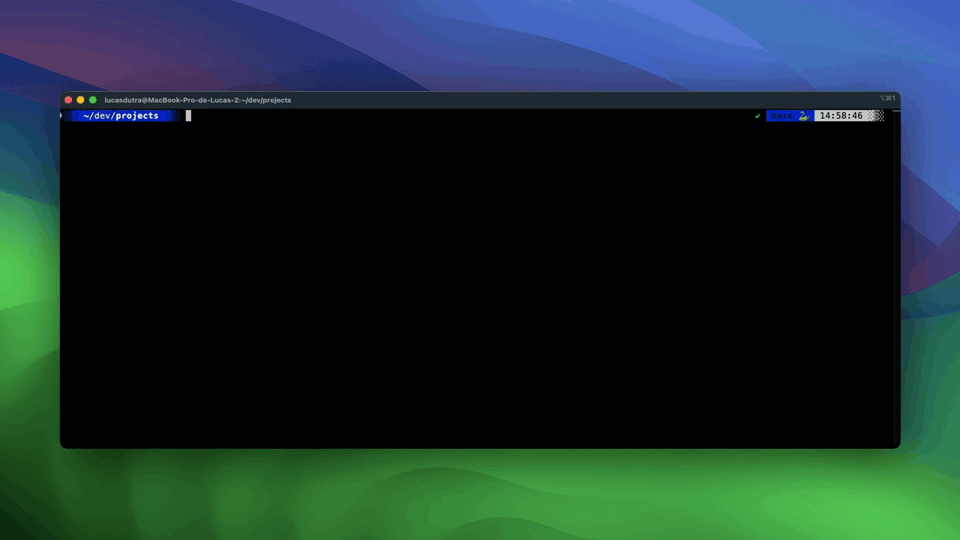

# quokka 🐹

> Inspect and clean a USB-connected device from your terminal: storage, apps, media, and a live log viewer. No jailbreak, no root.

[](https://github.com/dutradotdev/quokka/actions/workflows/ci.yml)
[](LICENSE)


quokka is a Mac CLI for the phone you have plugged in — iPhone **or** Android.
It reads storage, battery, apps, media, identity, and the live system log; it
can also reclaim space and reboot the device. iPhones are reached over
`usbmuxd` and lockdown-classic services (no jailbreak, no `core_device_proxy`
tunnel); Android devices over a local `adb` server (no root). No elevated
privileges on either.

Works on iOS 17+ and Android 8+.

## What you can do with it

- **Tail the device syslog while you debug.** `qk logs` opens a TUI viewer that filters live logs by level or process, with search, pause, and save. `--no-tui` streams plain text for piping or CI.
- **Free up space on a test device.** `qk analyze` ranks the heaviest media files and `qk media -d` groups likely duplicates; both can delete from an interactive picker.
- **Manage installed apps by size.** `qk apps` lists user apps largest-first and uninstalls by bundle id, with `--yes` for scripts.
- **Read device, system, and storage state.** `qk status` and `qk info` print it in clean blocks; `--redact` masks serial, UDID, IMEI, and MAC for safe screenshots.

## Quick start

```sh
brew install dutradotdev/tap/quokka-cli
qk
```

With no arguments, `qk` opens the interactive launcher. See [Install](#install)
below for `curl` and `cargo` alternatives.

## Demo



## Commands

| Command           | What it does                                                                                                                                        |
| ----------------- | --------------------------------------------------------------------------------------------------------------------------------------------------- |
| `quokka`          | Interactive launcher. Dashboard plus a menu to jump into any command below.                                                                         |
| `quokka status`   | Print the device dashboard once.                                                                                                                    |
| `quokka info`     | Static identity in three blocks (Device / System / Network). `--redact` masks serial, UDID, IMEI, and MAC for safe screenshots.                     |
| `quokka apps`     | Picker of installed user apps by size. `--uninstall <bundle-id>` removes one directly.                                                              |
| `quokka analyze`  | Walk media folders and surface the heaviest files. Read-only by default; `--delete` opens a picker.                                                 |
| `quokka media`    | Survey camera roll and downloads. Per-kind counts, per-month breakdown, top-10 largest. `-d` adds likely-duplicate groups.                          |
| `quokka logs`     | Stream the device's system log (syslog / logcat) in a TUI viewer. Filter by level or process, search, pause, save. `--no-tui` streams plain stdout. |
| `quokka reboot`   | Soft reboot the device. Confirms by default; `--yes` skips.                                                                                         |
| `quokka shutdown` | Power off the device. Confirms by default; `--yes` skips.                                                                                           |
| `quokka devices`  | List every device reachable over `usbmuxd` (iOS) or `adb` (Android). Does not select one.                                                           |
| `quokka card`     | Render a 1080×1080 PNG snapshot of the device, a neofetch-style flex card. Saves to `~/Desktop` and opens in Preview by default.                    |

## Examples

```sh
qk status                              # one-shot device dashboard
qk info                                # full identity (Device + System + Network)
qk info --redact                       # ...with serial / UDID / IMEI / MAC masked

qk apps                                # interactive app picker (sizes stream in live)
qk apps --uninstall com.example.app    # uninstall a specific app (asks to confirm)
qk apps --uninstall com.example.app --yes   # ...without the confirmation prompt

qk analyze                             # print the 20 heaviest media files
qk analyze --top 50                    # ...the heaviest 50 instead
qk analyze --delete                    # interactive deletion picker (needs a TTY)

qk media                               # camera roll / downloads survey
qk media -d                            # ...plus likely-duplicate groups

qk logs                                # TUI log viewer (q to quit)
qk logs --no-tui --min-level warning   # plain-stream mode, warning+ only
qk logs --no-tui --process SpringBoard --save /tmp/sb.log  # filter + tee

qk reboot                              # asks to confirm
qk shutdown --yes                      # non-interactive

qk card                                # render a 1080x1080 PNG to ~/Desktop and open in Preview
qk card --output ~/Pictures/me.png     # custom output path
qk card --no-open --redact             # don't open Preview, mask anything personal

qk status --json                       # machine-readable output (also: info/apps/analyze/media/devices)
qk info --redact --json | jq .         # redaction applies before serialization
qk logs --json                         # NDJSON stream, one JSON object per log line
```

Every query command takes `--json`: it prints the same data the GUI consumes,
so you can pipe quokka into `jq` or another tool. `logs --json` streams NDJSON
(one object per line); `card` (an image) and `capture` (a live TUI) stay out of
`--json`.

## Picking a platform and device

quokka autodetects whether you have an iPhone (over `usbmuxd`) or an Android
device (over `adb`) plugged in. Force one with `--platform ios|android` (or the
`QK_PLATFORM` env var) when both are connected and you want a specific one.

If you have more than one device plugged in — across either platform — the bare
`qk` launcher lists them all in a sidebar so you can switch between them. For a
specific subcommand, pick which device it talks to:

```sh
qk devices                              # list every device (iOS + Android) with name + model + id
qk --udid 00008130-0019... info         # target an iPhone by UDID
qk --udid ABCD1234 info                 # ...or an Android by adb serial
QK_UDID=00008130-0019... qk apps        # ...or via env var for a whole shell session
qk --platform android status            # force the Android backend

qk info                                 # 2+ devices on a TTY: opens an interactive picker
qk info                                 # 2+ devices in a pipe/CI without --udid: errors with a hint
```

`--udid` is a global flag that works on every subcommand (long-only; there is
no `-d` short form because `qk media -d` already means `--find-duplicates`). It
takes an iPhone UDID or an Android adb serial, and also reads from `QK_UDID` in
the environment, so you can set it once per shell.

## Requirements

- A Mac, with a phone connected via cable.

**For an iPhone:**

- The Xcode command line tools (`xcode-select --install`) supply `usbmuxd`.
- The device must be trusted: the first time you plug it in, unlock the iPhone
  and tap _Trust this computer_.
- iOS 17 or newer.

**For an Android device:**

- `adb` on your `PATH` — `brew install android-platform-tools`.
- USB debugging enabled (Developer options), and the _Allow USB debugging_
  prompt accepted for this Mac.
- Android 8 or newer (so the `adb` shell can read per-app sizes from
  `dumpsys diskstats` without root).
- Without root, some fields are best-effort: app names show as package ids,
  battery health/cycles are unavailable, and packet capture (`qk capture`) is
  iOS-only.

## Install

### Homebrew (recommended)

```sh
brew install dutradotdev/tap/quokka-cli
```

Works on Apple Silicon and Intel. `brew upgrade` keeps you on the latest
release.

### One-line installer (no Homebrew)

```sh
curl --proto '=https' --tlsv1.2 -LsSf \
  https://github.com/dutradotdev/quokka/releases/latest/download/quokka-cli-installer.sh | sh
```

Pulls the prebuilt binary from GitHub Releases into `~/.cargo/bin`. Re-run the
same command to update.

### Cargo (build from source)

If you already have a Rust toolchain:

```sh
cargo install --git https://github.com/dutradotdev/quokka quokka-cli
# or, from a local clone:
cargo install --path crates/quokka-cli
```

Slower because it compiles locally. Use this when you want to track `main`
between tagged releases.

Every install method drops two binaries on your `PATH`: `quokka` and the
shorter `qk`. They share the same code, so `qk status` and `quokka status` do
the same thing.

## Development

```sh
cargo build
cargo test                  # unit + integration, no iPhone needed
cargo test --features e2e   # adds tests that need a real iPhone over USB
cargo test --features e2e-android   # adds tests that need a real Android over adb
cargo clippy --all-targets -- -D warnings
cargo fmt
```

quokka is a Cargo workspace with two crates: **`quokka-core`** (the
presentation-free `Device` seam, the application facade, and the pure
projection/format logic — the crate a GUI would depend on) and **`quokka-cli`**
(the `quokka`/`qk` binaries and all terminal UI). All `cargo` commands run from
the repo root and span the workspace.

- [CONTRIBUTING.md](CONTRIBUTING.md): how to set up, test, and submit a change.
- [docs/ARCHITECTURE.md](docs/ARCHITECTURE.md): how quokka is put together and why.
- [CHANGELOG.md](CHANGELOG.md): what changed between versions.
- [SECURITY.md](SECURITY.md): how to report a vulnerability.

Every push and pull request runs through [CI](.github/workflows/ci.yml):
formatting, clippy, the full test suite, `cargo audit`, and `cargo deny`.

## Tested devices

Verified end-to-end on real hardware. OEM quirks (storage reporting, `find`
flavours) tend to surface here first — if quokka works on a device not listed,
a PR adding a row is welcome.

| Platform | Device               | OS         |
| -------- | -------------------- | ---------- |
| iOS      | iPhone 15 Pro Max    | iOS 26.5   |
| Android  | Redmi Note 9S (MIUI) | Android 12 |

## Acknowledgments

`qk card` ships with [JetBrains Mono](https://github.com/JetBrains/JetBrainsMono)
embedded in the binary so the rendered PNG looks the same on every machine.
JetBrains Mono is distributed under the
[SIL Open Font License 1.1](assets/fonts/OFL.txt); the bundled font files are
unmodified copies.

Badge artwork uses [Twemoji](https://github.com/jdecked/twemoji) by Twitter
and contributors, licensed under
[CC-BY 4.0](https://creativecommons.org/licenses/by/4.0/). The bundled SVGs
are unmodified copies.

## License

MIT. See [LICENSE](LICENSE).
